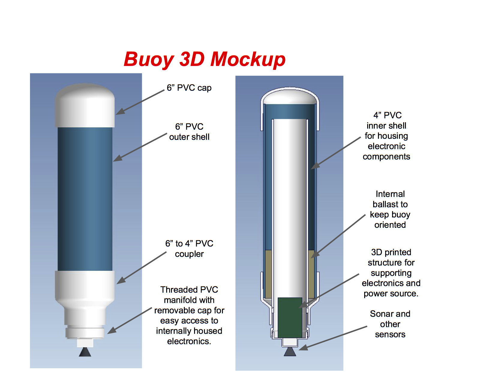

# Sonobuoy Intern Project

## Goal

Design and build a sonobuoy capable of detecting, logging, and relaying threats autonomously.

## Design

### Software

Implement data structures capable of calibrating and continually updating given input from sensor reads. Then, analyze that data to detect threats using some sort of threat classification algorithm. Log and relay those threats however applicable. Recaibrate and repeat.

In our case, we assumed a normal distribution of the sensor data. This allowed for the operator to define the number of standard deviations that should be considered "plausible" before an error is caught. These thresholds can differ from sensor to sensor. For example, a standard dev input of 1 would log a threat on average 32% of the reads (assuming normal distribution). Higher input params lead to catching more meaningful threats. A complete table can be found here [Standard Deviation Probability Table](https://en.wikipedia.org/wiki/68%E2%80%9395%E2%80%9399.7_rule).

### Mechanical

The buoy is built from 2 pvc pipes, one inside the other. A sand ballast was put between the outter and inner pvc pipes to orient the buoy and protect from shock. The microcontroller is housed in the internal pipe which is then sealed off from the water using pvc pipe caps. Holes were drilled for the waterproof sensors to be wired to the microcontroller and then sealed.

  

## Extendability

More complex anomaly detection algorithms could be implemented in the future. Additionally, given longer calibration times, more significant amounts of data could be used to analyze potential threats. 

## Results

Follow our completion of the buoy, it was entered into a Lockheed Martin internal head to head competition. Judges concluded out buoy to be the winner. 

## Team

| Member Name       | Member Role                      |
|-------------------|----------------------------------|
| Gideon Pfeffer    | Lead Software Engineer           |
| Praveen Jayakumar | Software and Electrical Engineer |
| Celine Stewart    | Software and Electrical Engineer |
| Curtis Huggins    | Lead Mechanical Engineer         |
